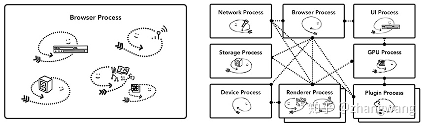

# 浏览器

## 浏览器里的进程线程

一个浏览器，它可以是单进程多线程的应用，也可以是使用 IPC 通信的多进程应用。

Chrome 采用多进程架构，其顶层存在一个 Browser process 用以协调浏览器的其它进程。

Chrome 把浏览器不同程序的功能看做服务，这些服务可以方便的分割为不同的进程或者合并为一个进程。以 Broswer Process 为例，如果 Chrome 运行在强大的硬件上，它会分割不同的服务到不同的进程，这样 Chrome 整体的运行会更加稳定，但是如果 Chrome 运行在资源贫瘠的设备上，这些服务又会合并到同一个进程中运行，这样可以节省内存。  
[Site Isolation](https://developers.google.com/web/updates/2018/07/site-isolation) 机制从 Chrome 67 开始默认启用。这种机制允许在同一个 Tab 下的跨站 iframe 使用单独的进程来渲染，这样会更为安全。

## 从 URL 到页面

### 导航

浏览器 Tab 外的工作主要由 Browser Process 掌控，属于**导航流程**，Browser Process 对这些工作进一步划分，使用不同线程进行处理：

- UI thread ： 控制浏览器上的按钮及输入框；
- network thread: 处理网络请求，从网上获取数据；
- storage thread: 控制文件等的访问；

**导航流程：**

1. UI thread 解析地址栏输入的信息，判断是否为合法 URL
   - 否：使用默认搜索引擎合成带有输入信息的 url 进行搜索
   - 是：url 则判断是否完整，弱不完整则通过内置的方案来对其进行补全
2. 通知 network thread
   - 检查本地缓存资源，如果有直接返给浏览器进程。
   - 没有找到本地缓存资源或者需要验证资源是否有效，则会进入网络请求流程。
   - 如果 url 是 ip 地址，则直接进入 TCP 连接阶段。
   - 如果 url 是域名则需要 DNS 解析，得到 ip 地址，再建立 TCP 连接。
   - 进入 TCP 队列，单域名限制最多 6 个，超过需要排队等待。浏览器和服务器通过三次握手建立连接。
   - 如果是 Https，则建立 TCP 连接之后建立 TLS 连接，安全地交换对称密钥。
   - 连接建立后，构建请求行，请求头等信息，发送请求，接收响应。
   - 解析响应头，状态码，301、302 则通知 UI thread 服务器要求重定向，之后，另外一个 URL 请求会被触发。
   - 状态码 200 则解析响应体，contentTpe，若为字节流类型则提交给下载管理器处理，Html 类型则准备进入渲染阶段。Safe Browsing 检查也会在此时触发，如果域名或者请求内容匹配到已知的恶意站点，network thread 会展示一个警告页。此外 CORB 检测也会触发确保敏感数据不会被传递给渲染进程。
3. network thread 确信浏览器可以导航到请求网页，network thread 会通知 UI thread 数据已经准备好，UI thread 会查找到一个 renderer process 进行网页的渲染。如果当前打开的页面和该请求是同一个站点，则复用该渲染进程，否则新创建一个渲染进程。
4. Browser Process 将 network thread 接收的 HTML 数据提交给 renderer process。进入渲染流程。
5. 渲染结束，renderer process 通知 Browser Process，UI thread 停止 tab 中的 spinner

### 渲染

由 JS 引擎和渲染引擎处理

#### 渲染进程 renderer process

1. 主线程 Main thread
2. 工作线程 Worker thread
3. 合成器线程 Compositor thread
4. 光栅线程 Raster thread

#### 渲染流程

1. 解析 html  
   html 源码通过 xml parser 解析成 dom
2. 加载资源  
   主线程会请求构建 dom 过程中引用的资源或从 cache 读取，如果在 html 中存在 `` `<link>` 等标签，preload scanner 会把这些请求传递给 Browser process 中的 network thread 进行相关资源的下载。
3. 加载执行 js(js 引擎)  
   因为 `document.write()`等 API 会影响 Dom 结构，所以遇到`<script>`，会停止解析 HTML，而去加载解析和执行 JS 代码，因此为其添加`async`或`defer`等属性异步加载，不会阻塞渲染。
4. 解析样式  
   css 源码通过 css parser 解析，获取每个节点的样式，构建出 style 树，包含节点内容和样式。
5. 布局  
   遍历 dom，及节点样式，主线程基于 style 树构建出 layout 树(仅包含可见 dom)，包含位置信息。
6. 绘制  
   主线程遍历 layout 树，创建绘制记录(包含绘制顺序)。
7. 合成帧  
    主线程遍历 layout 树来创建 layer tree（层树，包含层级），主线程会把这些信息通知给 compositor thread。compositor thread 对`层`进行栅格化，有的层的可以达到整个页面的大小，compositor thread 会将它切块(磁贴)后发送给 Raster thread，栅格化每一个块并存储在 GPU 显存中。compositor thread 会收集称为绘制四边形的磁贴信息以创建合成帧。当页面合成时，compositor thread 会标记页面中绑定有事件处理器的区域为 non-fast scrollable region。

   **Tips:**

   - 由于浏览器的 UI 改变或者其它拓展的渲染进程也可以添加合成帧。
   - 合成器无关主线程，不涉及重绘重排，因此[合成器相关动画](https://www.html5rocks.com/en/tutorials/speed/high-performance-animations/)最流畅。
   - 滚动发生或非快速滚动区域（non-fast scrollable region）外的事件触发，重复该步骤。该区域内的事件触发会提交给主线程同步处理。

   ```js
   document.body.addEventListener(
     "touchstart",
     (event) => {
       if (event.target === area) {
         event.preventDefault();
       }
     },
     { passive: true }
   ); // passive: true 使监听相关事件时，又不阻塞合成器线程在等待主线程响应前构建新的组合帧。 且不调用preventDefault
   //https://developer.mozilla.org/zh-CN/docs/Web/API/EventTarget/addEventListener#%E4%BD%BF%E7%94%A8_passive_%E6%94%B9%E5%96%84%E7%9A%84%E6%BB%9A%E5%B1%8F%E6%80%A7%E8%83%BD
   ```

8. 合成帧通过 IPC 传递给 Browser Process，Browser Process 再传递给 GPU 用以展示在屏幕上。
   > 参考：[图解浏览器的基本工作原理](https://zhuanlan.zhihu.com/p/47407398)

## 事件循环

由上可知浏览器内核：渲染引擎和 JS 引擎，js 和渲染是分开的。  
JS 引擎处理 JavaScript 语言的一大特点就是单线程，同一个时间只能做一件事。为了协调事件、用户交互、脚本、UI 渲染和网络处理等行为，防止主线程的阻塞，才有 Event Loop。

1. 先同步执行 js，遇到宏任务立即执行，遇到微任务，将其推入微任务队列，执行完宏任务后执行微任务
2. 然后检查是否需要渲染
3. 需要渲染则执行 requestAnimationFrame(重绘之前执行)后切换到渲染引擎渲染
4. 渲染后/不需要渲染则检查 worker
5. 然后在一帧中的剩余时间内执行 requestIdleCallback

宏任务：  
script,setTimeout,setInterval,setImmediate,I/O，postMessage  
微任务：  
mutationObserve：比如 vue 的 nextTick 的实现之前使用到了（仅浏览器）  
promise 的 resolve，async,await  
process.nextTick ：每个类型队列结束后执行

> 参考：  
> [Event Loop 和 JS 引擎、渲染引擎的关系](https://juejin.cn/post/6961349015346610184)  
> [node 中的事件循环](https://www.bilibili.com/video/BV1864y117PQ?p=3)

## 浏览器一帧内发生了什么

- 处理用户输入事件；
- 执行 JS；
- check 渲染
- requestAnimation 调用
- 渲染
- check worker
- requestIdleCallback 回调  
  浏览器空闲时间：16ms 内处理完以上的剩余时间就是空闲时间  
  浏览器很忙的情况：
  requestIdleCallback 的 timeout 参数，如果超过这个时间，还没被执行，那么会在下一帧强制执行回调（兼容性较差）
