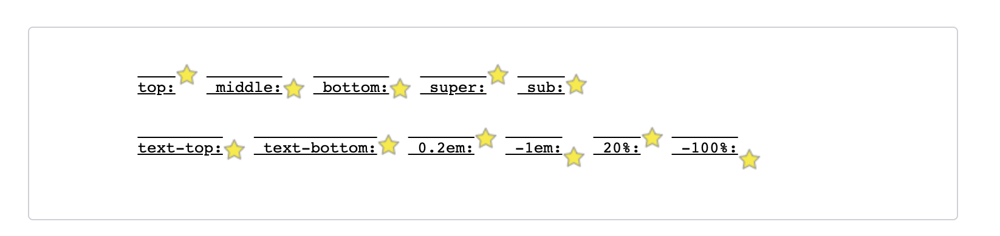

## 布局

### flex 布局

父元素属性：justify-content，align-items，align-content  
子元素属性：flex，align-self

```css
/* flex-grow: 主轴方向有剩余空间时增长比例，可用来实现左右固定宽，中间自适应布局 */
/* flex-shrink: 主轴方向宽度不够时坍缩比例 */
/* flex-basis: 主轴方向上 初始大小 作用于子项*/
/* 两个值: flex-grow | flex-basis */
flex: 1 30px;
/* 两个值: flex-grow | flex-shrink */
flex: 2 2;
/* 三个值: flex-grow | flex-shrink | flex-basis */
flex: 2 2 10%;
/* align-self: 次轴方向对齐方式（单行情况） */
/* align-content: 换行情况下，次轴对齐方式，和align-self类似，对单行（flex-wrap: nowrap）无效*/
```

### grid 和 flex 各自的应用场景

#### 是一维布局 还是 二维布局

一般来说，一维布局用 flex，二维布局用 grid

#### 是从内容出发还是从布局出发？

- 从内容出发用 flex：先有一组内容(数量一般不固定),然后希望他们均匀的分布在容器中，由内容自己的大小决定占据的空间
- 从布局出发用 grid：先规划网格(数量一般比较固定)，然后再把元素往里填充

### rem 和 em 区别

1em: 是父元素或本身 font-size，向上找  
rem: 根元素 font-size

### touch-action

可以使用 css 属性 `touch-action` 来完全消除事件处理器的影响，如：  
#area {  
 touch-action: pan-x;  
}

### gap

gap 属性是用来设置网格行与列之间的间隙（gutters），该属性是 row-gap column-gap 的简写形式。

### 伪元素、伪类

:not 连用：

```css
/* 既不是 <div> 也不是 <span> 的元素 */
body :not(div):not(span) {
  font-weight: bold;
}
```

:has:  
其不能用于样式表中，只能用于如 document.querySelector() 的函数中

```css
/* 选择任何直接包含  子元素的 <a>  */
/* 注意，目前还没有任何浏览器支持此方法 */
/* 此伪类也未计划投入样式表中使用 */
var test = document.querySelector('a:has(> img)');
```

### vertical-align

指定行内元素/表格单元格元素的垂直对齐方式


### 隐藏滚动条

对设置了 overflow:auto、scroll 的元素设置

```css
div{
   scrollbar-width: none; /* Firefox */
   -ms-overflow-style: none; /* IE 10+ */
}
div::-webkit-scrollbar{
   display: none; /* Chrome Safari */
}
```
