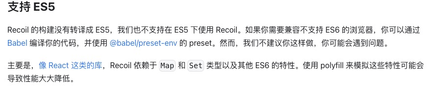
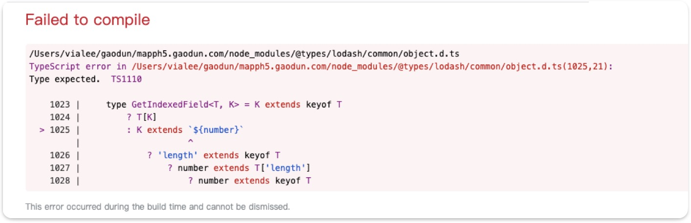

<!-- ### install 报错
// error An unexpected error occurred: "https://r2.cnpmjs.org/rc-menu/-/rc-menu-9.1.1.tgz: unable to verify the first certificate".
 -->

## 2022

### eslint 报错 忽略

1. /_ eslint-disable _/
2. 在.eslintrc.js>rules 添加@typescript-eslint/no-var-requires ，如下：
   rules: {
   "@typescript-eslint/no-var-requires": 0,
   }

### 下载文件 文件过大 报错

```js
export const download = (url, name) => {
  const xhr = new XMLHttpRequest();
  xhr.open("GET", url, true);
  // 以二进制文件修改
  xhr.responseType = "blob";
  xhr.onload = () => {
    const url = window.URL.createObjectURL(xhr.response);
    var a = document.createElement("a"); //新建a标签
    a.download = name || "file"; //下载下来的文件名
    a.href = url;
    var event = new MouseEvent("click");
    a.dispatchEvent(event);
  };
  xhr.onreadystatechange = function () {
    // 下载时readyState===3，一次请求一直被调用
    console.log(xhr.readyState);
  };
  //  中途 xhr.abort() xhr.readyState===0 且 xhr.status===0
  xhr.send();
};
```

readyState 属性表示 Ajax 请求的当前状态。
0 代表未初始化。 还没有调用 open 方法
1 代表正在加载。 open 方法已被调用，但 send 方法还没有被调用
2 代表已加载完毕。send 已被调用。请求已经开始
3 代表交互中。服务器正在发送响应
4 代表完成。响应发送完毕

场景：某些电脑(同一用户)，下载同样的文件，从页面点击下载报错，浏览器贴链接下载正常。
报错：

1. Get net::ERR_CONTENT_LENGTH_MISMATCH 200 (OK)
   Status Code: 200 OK
   network status (failed)net::ERR_CONTENT_LENGTH_MISMATCH
2. (failed)net::ERR_FAILED 200 (OK) network 中的 sourceSize 为 0  
   请求异常中断导致没有下载

### chrome 点击浏览器回退 页面不刷新

chrome 的 back/forward cache 机制

<!--
### umi request 做了哪些处理

### 微前端 通讯 -->

## 2023

### 02/02 taro 项目编译 h5 白屏

1. 部分安卓手机 UC 浏览器、苹果 safri 浏览器页面白屏；
   本地启动真机访问无异常  
   本地编译 h5 后使用真机访问白屏

解决过程：  
 使用 vconsole，CDN 方式引入，看到白屏页面报错：  
'Uncaught SyntaxError:'super' keyword unexpected here'  
是项目中使用的 Recoil 兼容性问题，查看官网发现不支持 ES5，得另外使用 babel 编译。  
将 Recoil 以 CDN 方式引入得以解决。暂未找到其他更好的办法。



2. 使用 Taro.redirectTo,reLaunch 跳转，路由变化但页面白屏
   版本升级

3. 编译报错，sass 中不支持/运算  
   打补丁，单独处理

### 03/09 组件库打包优化

包体积优化：

<!-- ### 视频水印 -->
<!-- canvas 定位文字，生成图片，放在video同级，用mutationObserve监听dom变化、属性变化，水印被删除时再生成一张 -->

### 04/14 Error TS1110 Build: Type expected



ts 版本过低,缺少部分类型定义,升级

```
"typescript": "^3.7.5"
"typescript": "4.2.4",
```

### 04/19 egg 混合 react 页面项目

老项目采用 egg、jquery 开发、部分页面采用 react 重构、目前方案是将新页面放在一个 react 项目内打包放在老项目里，路由直接读取打包后的产物，问题：

1. 统一导航栏，新老页面都是用 react 中的导航栏  
    将导航栏单独打包输出，在老页面读取产物

   ```js
   //webpack 配置
   webpackConfig.entry = {
     header: path.resolve(__dirname, "./src/header.tsx"),
   };
   plugins: [
     new htmlWebpackPlugin({
       filename: "header.html",
       chunks: ["header"],
       template: path.resolve(__dirname, "./public/header.html"),
     }),
   ];
   ```

2. 需要区分环境读取对应的 build 包，全局变量\_system_env 通过中间件统一传入

   ```ejs
   <%- include('../../public/build-'+_system_env+'/header.html') -%>
   ```

3. antd 全局样式污染问题  
   没有发现好的解决办法、暂时通过覆盖解决

### 04/20 协助 App 解决问题

#### 内嵌 H5 页面获取 app 的 token，首次未获取到

安卓环境，清除缓存后重新登录 App，进入 h5 页面，未获取到 token，第二次进入 h5 页面正常。

- h5 页面 PC、H5、App 共用，需要区分当前环境
- token 有三种情况、H5 自身登录、PC 跳转 URL 带入、App 登录获取
- 区分是否首次从 App 进入，决定是否要获取 App token

#### app 内退出登录需要跳转到 App 登录页

- 区分环境
- 跳转 URL Schema
