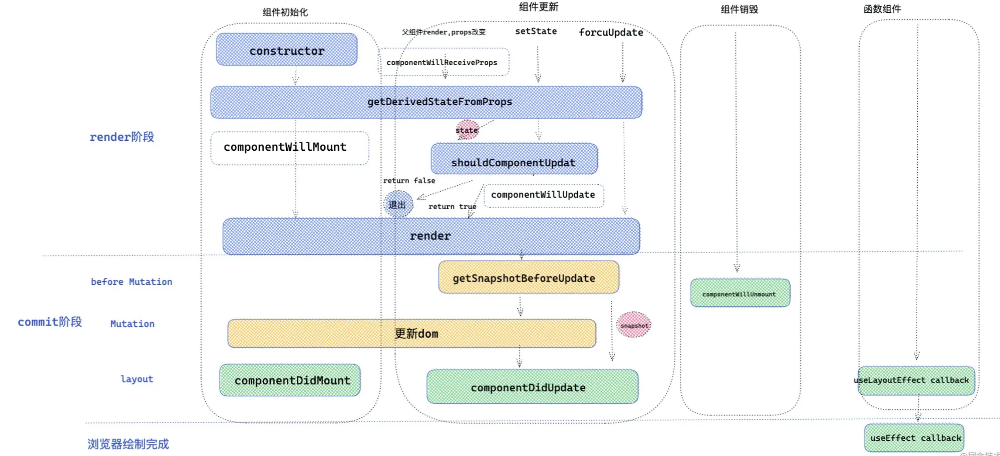
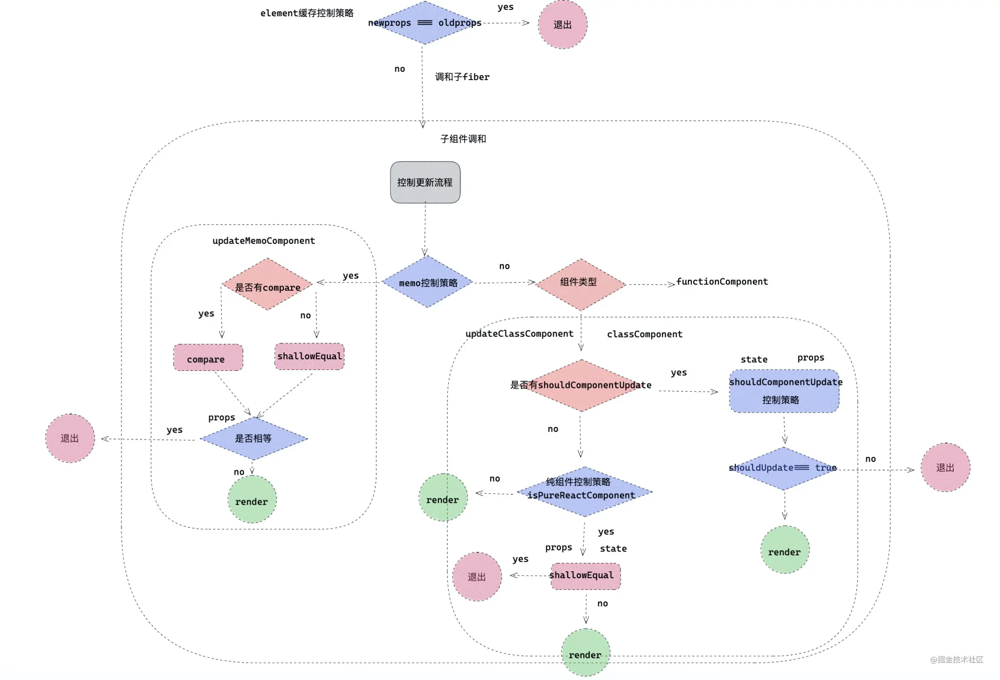

# React


## Jsx

react 中，经过 babel 编译-->React.createElement  
React DOM 在渲染所有输入内容之前，默认会进行转义，这样可以有效地防止 XSS（cross-site-scripting, 跨站脚本）攻击。

## 生命周期

错误处理：  
static getDerivedStateFromError(error)  render阶段，不可有副作用  
componentDidCatch()  commit阶段，可有副作用  
componentDidUpdate 与useEffect无依赖类似，每一次执行函数组件都会执行
#### getSnapshotBeforeUpdate
获取更新前 DOM 信息的最佳时期，可进行和dom相关的计算
return一个快照作为componentDidUpdate的第三个参数

#### useEffect和useLayoutEffect和componentDidMount
useEffect在commit阶段的layout子阶段结束后异步调用（渲染后调用）  
componentDidMount和useLayoutEffect：commit的layout阶段同步调用（渲染前调用）

<!-- ### 事件委托 -->
## Fiber
ReactElement —— reconciler ——> fiber  
14中fiber类型，关系有三种：child，return，sibling
```js
export const FunctionComponent = 0;       // 函数组件
export const ClassComponent = 1;          // 类组件
export const IndeterminateComponent = 2;  // 初始化的时候不知道是函数组件还是类组件 
export const HostRoot = 3;                // Root Fiber 可以理解为根元素 ， 通过reactDom.render()产生的根元素
export const HostPortal = 4;              // 对应  ReactDOM.createPortal 产生的 Portal 
export const HostComponent = 5;           // dom 元素 比如 <div>
export const HostText = 6;                // 文本节点
export const Fragment = 7;                // 对应 <React.Fragment> 
export const Mode = 8;                    // 对应 <React.StrictMode>   
export const ContextConsumer = 9;         // 对应 <Context.Consumer>
export const ContextProvider = 10;        // 对应 <Context.Provider>
export const ForwardRef = 11;             // 对应 React.ForwardRef
export const Profiler = 12;               // 对应 <Profiler/ >
export const SuspenseComponent = 13;      // 对应 <Suspense>
export const MemoComponent = 14;          // 对应 React.memo 返回的组件
```


## Children相关API
React.isValidElement(item) 判断是否 react element 
React.Children.only  子节点是否单一
React.Children.forEach 遍历子节点
React.Children.forEach = React.Children.toArray + Array.prototype.forEach
>通常与React.cloneElement()一起使用操作children,注入新的属性
## 渲染控制


控制 render 的方法：

- 从父组件直接隔断子组件的渲染，经典的就是 memo，缓存 element 对象。
- 组件从自身来控制是否 render ，比如：PureComponent ，shouldComponentUpdate。

### 缓存 element 对象减少更新原理

每次 render 阶段，createElement 会创建一个新的 props(pendingProps)，react 对比 fiber 上的 pendingProps 和 oldProps，如果相等，则不更新。将 element 对象缓存起来，上面 props 也就和 fiber 上 oldProps 指向相同的内存空间，也就是相等。

### PureComponent

浅比较 state 和 props 是否相等；
shouldComponentUpdate 的权重，大于 PureComponent；
更新阶段对 state 和 props 的比较，用了 _shallowEqual_ 函数：

1. 判断新老 state/props 是否相等
2. 新老 state/props 是否为非对象/null
3. 新老 state/props 的 keys 长度是否相等
4. 遍历老 state/props，对比对应新 state/props 的值是否相等

### React.memo

是一个高阶组件

```js
React.memo(Component, compare);
// compare 返回true：缓存，false：更新
// shouldComponentUpdate 返回true：更新，false：缓存
// compare 不传->使用shallowEqual函数浅比较props
```
### 强制重新渲染

1. forceUpdate：  
   如果组件调用 forceUpdate,则全局的 hasForceUpdate=true，组件更新前检查如果为 true，则跳过 PureComponent 的浅比较和 shouldComponentUpdate 自定义比较，直接更新
2. context 的更新

### Suspense
Suspense 在执行内部可以通过 try{}catch{} 方式捕获异常，这个异常通常是一个 Promise ，可以在这个 Promise 中进行数据请求工作，Suspense 内部会处理这个 Promise ，Promise 结束后，Suspense 会再一次重新 render 把数据渲染出来，达到异步渲染的效果。

<!-- React.lazy(() => import('./test.js'))   -->


## Hooks

### useCallback 和 useMemo 区别

useCallback 缓存第一个参数；  
useMemo 执行第一个参数，缓存其结果。
